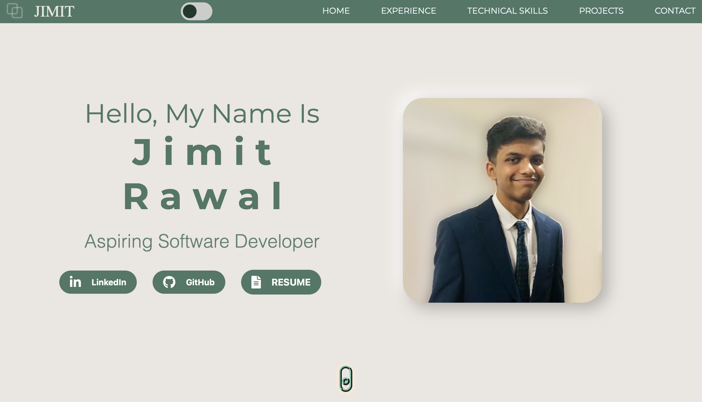

# Personal Portfolio Website

A visually dynamic and fully responsive Bootstrap website to showcase personal projects, achievements, and milestones.

Visit: https://jimitrawaldev.netlify.app


## Features

- Sleek and modern design with customizable color schemes and backgrounds.
- Responsive Navbar using Bootstrap for easy navigation.
- Interactive Bootstrap carousel for highlighting featured projects.
- Fully responsive layout ensuring seamless viewing across all devices.
- Stylish and user-friendly forms and input elements.
- Integrated contact form using Formspree.

## Usage

This website is built with [Bootstrap](https://getbootstrap.com/) and [CSS](https://developer.mozilla.org/en-US/docs/Web/CSS). It uses [Font Awesome](https://fontawesome.com/) for icons.

To customize this website, you need to have [Node.js](https://nodejs.org/en/) installed. After cloning this repository, run:

```bash
npm install
